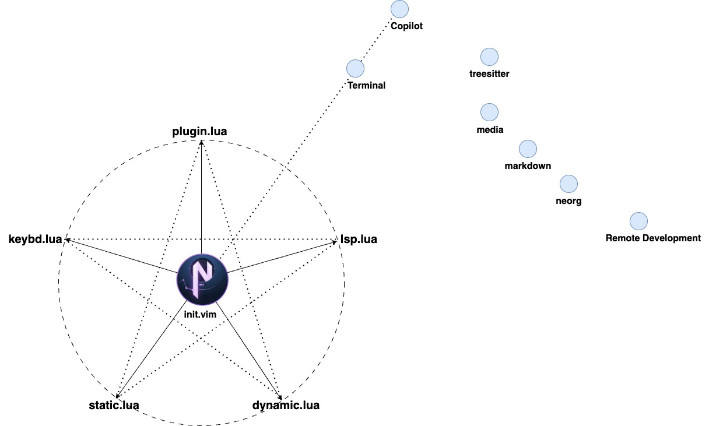

# TE-NeoVim
> "Grinding and polishing to refine with constant diligence."
## From Vi to Vim, then to NeoVim
Vi is short for “visual editor” and it is available in nearly identical form on every UNIX-like system.

Vim is a Unix based text editor that is fast and efficient as it can be run through a terminal. Vim is also commonly referred to Vi as the terms are interchangeable and both terms usually refer to Vim.

NeoVim is a refactor of Vim, primarily a more maintainable and extensible command-line interface (CLI) application, better support for asynchronous plugin execution and built-in terminal emulation. 

## Why Neovim
## The main features of TE-Neovim
## Installation
## Configuration Layout

├── init.vim
└── lua                                   all lua configuration files
    ├── basic                             Neovim basic configuration
    │   ├── static.lua
    │   ├── dynamic.lua
    ├── keybindings.lua                   For keybindings
    ├── lsp                               LSP (Language Server Protocol) 
    │   ├── diagnostic_signs.lua
    │   ├── language_servers.lua
    │   └── nvim-cmp-config.lua
    ├── plugin-config                     Plugins for various purposes
    │   ├── bufferline.lua
    │   ├── comment.lua
    │   ├── nvim-autopairs.lua
    │   ├── nvim-colorizer.lua
    │   ├── nvim-tree.lua
    │   ├── nvim-treesitter.lua
    │   ├── rust-tools.lua
    │   ├── surround.lua
    │   ├── telescope.lua
    │   └── which-key.lua
    └── plugins.lua                      Plugin management
## Introduction of vimscript and lua
## Keybindings
In Neovim, the keybindings are implemented through APIs. Neovim provides a list of API functions to set, get and delete mappings:
- Modes
- Leader Key: Space
- Local Variables
  map
  opt
- Examples:

## Lisence
## Contributor
## Reference
