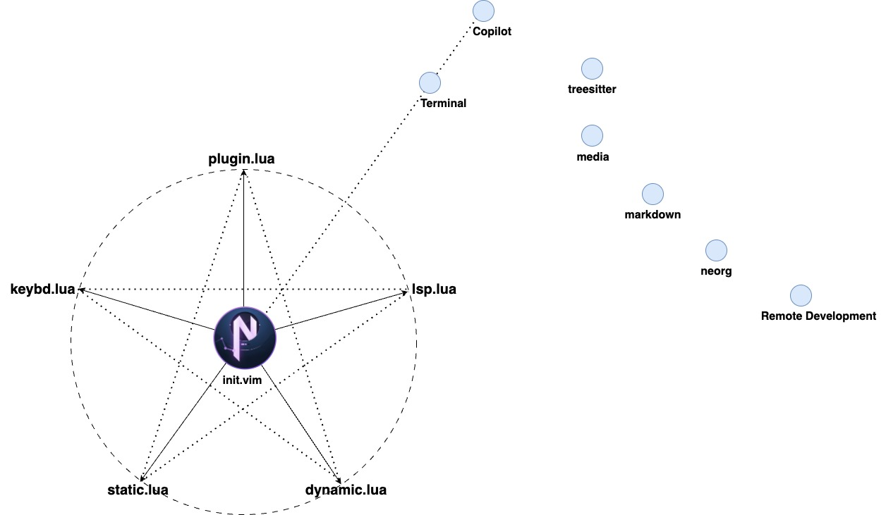

# TE-NeoVim
> "Grinding and polishing to refine with constant diligence."
## From Vi to Vim, then to NeoVim
Vi is short for “visual editor” and it is available in nearly identical form on every UNIX-like system.

Vim is a Unix based text editor that is fast and efficient as it can be run through a terminal. Vim is also commonly referred to Vi as the terms are interchangeable and both terms usually refer to Vim.

NeoVim is a refactor of Vim, primarily a more maintainable and extensible command-line interface (CLI) application, better support for asynchronous plugin execution and built-in terminal emulation. 

## Why Neovim
## The main features of TE-Neovim
## Installation
## Configuration Layout

## Lisence
## Reference
