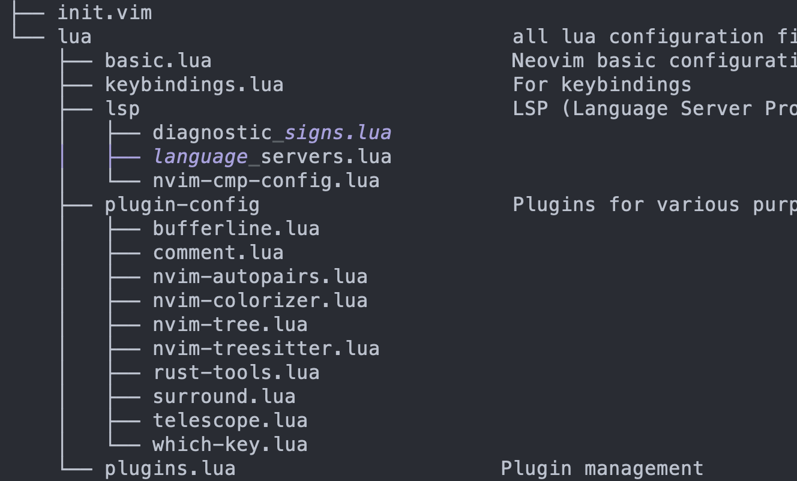

# TE-Neovim
## From Vi to Vim, then to Neovim
Vi is short for “visual editor” and it is available in nearly identical form on every UNIX-like system. 

Vim is a Unix based text editor that is fast and efficient as Vim can be run through a terminal. Vim is also commonly referred to Vi as the terms are interchangeable and both terms usually refer to Vim.
NeoVim is a refactor of Vim but is not a rewrite of but is an extension that removes the core issues of Vim. 

## Why Neovim
## The main features of TE-Neovim
## Installation
## 

├── init.vim
└── lua                                   all lua configuration files
    ├── basic.lua                         Neovim basic configuration
    ├── keybindings.lua                   For keybindings
    ├── lsp                               LSP (Language Server Protocol) 
    │   ├── diagnostic_signs.lua
    │   ├── language_servers.lua
    │   └── nvim-cmp-config.lua
    ├── plugin-config                     Plugins for various purposes
    │   ├── bufferline.lua
    │   ├── comment.lua
    │   ├── nvim-autopairs.lua
    │   ├── nvim-colorizer.lua
    │   ├── nvim-tree.lua
    │   ├── nvim-treesitter.lua
    │   ├── rust-tools.lua
    │   ├── surround.lua
    │   ├── telescope.lua
    │   └── which-key.lua
    └── plugins.lua                      Plugin management
## Lisence
## Contributor
## Reference
