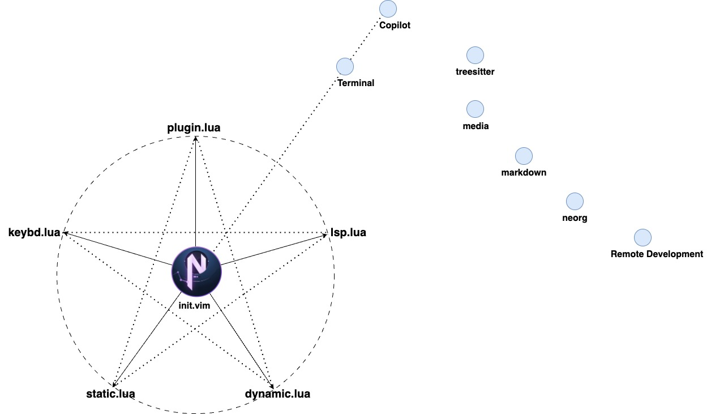

# TE-NeoVim
> "Grinding and polishing to refine with constant diligence."
## From Vi to Vim, then to NeoVim
Vi is short for “visual editor” and it is available in nearly identical form on every UNIX-like system.

Vim is a Unix based text editor that is fast and efficient as it can be run through a terminal. Vim is also commonly referred to Vi as the terms are interchangeable and both terms usually refer to Vim.

NeoVim is a refactor of Vim, primarily a more maintainable and extensible command-line interface (CLI) application, better support for asynchronous plugin execution and built-in terminal emulation. 

## Why Neovim
## Main Features
## Installation
## Configuration Layout

## Licence
This program is free software. You can redistribute and/or modify it under [Apache License](https://github.com/neovim/neovim/blob/master/LICENSE.txt) published by the Apache Software Foundation, as well as Copyleft under [ThingsEngine](https://thethingsengine.org) project. The contributions are shared with the hope that this program will be useful, helpful and inspiring, but without any warranty; without even the implied warranty of merchantability or fitness for a particular purpose.
## Reference
